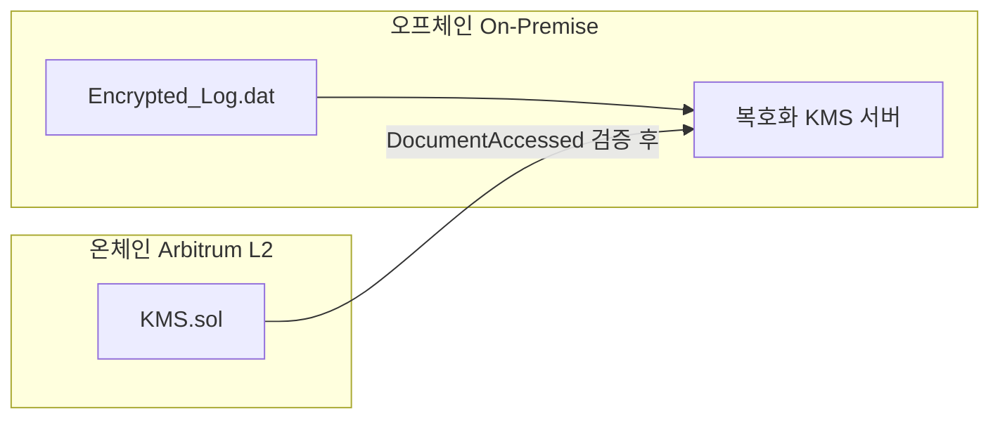

# MultiSig-KMS

블록체인 기반 분산 키 관리(KMS) 프로젝트 — **가천대학교 블록체인 시스템 설계 및 실습**

중앙 서버·단일 마스터 키의 단일 실패 지점(SPoF)을 줄이고, **암호화된 기밀 로그**(차량 블랙박스, 기업 문서 등)에 대한 **복호화 권한**을 Arbitrum L2 스마트 컨트랙트의 **2-of-3 멀티시그**로 통제합니다.

- **원본 데이터:** On-Premise 서버에 암호화 저장 (`Encrypted_Log.dat`) — 체인·IPFS 미업로드  
- **온체인:** `contracts/KMS.sol` — 화이트리스트, 다중 승인, 즉시 회수, 불변 감사 이벤트  

상세 아키텍처: [docs/ARCHITECTURE.md](docs/ARCHITECTURE.md)

---

## 하이브리드 구조 (요약)



---

## 역할

| 역할 | 온체인 | 주요 함수 |
|------|--------|-----------|
| 슈퍼 관리자 | `DEFAULT_ADMIN_ROLE` | `grantPermission`, `revokePermission` |
| 결재권자 ×3 | `APPROVER_ROLE` | `approveAccess` |
| 요청자 | 화이트리스트 주소 | `requestDocumentAccess` |

접근 확정 조건: **승인자 3명 중 2명 이상** (`approvalCount >= 2`) → `DocumentAccessed` 이벤트

---

## 기술 스택

| 항목 | 버전·도구 |
|------|-----------|
| Solidity | 0.8.20 |
| 프레임워크 | Hardhat 2.x |
| 라이브러리 | OpenZeppelin Contracts 5.x (`AccessControl`) |
| L2 (설정) | Arbitrum Sepolia |
| 개발 환경 | Dev Container (Node 20) |

---

## 빠른 시작

### 1. 저장소 클론 & 의존성

```bash
git clone https://github.com/June0727-JUNGLE/blockchain-based-KMS.git
cd blockchain-based-KMS
npm install
```

### 2. 환경 변수 (배포·Sepolia용)

```bash
cp .env.example .env
# .env 에 ARBITRUM_SEPOLIA_URL, PRIVATE_KEY 입력 (테스트 지갑만 사용)
```

> `.env`는 **절대 Git에 올리지 마세요.** `.gitignore`에 등록되어 있습니다.

### 3. 컴파일

```bash
npx hardhat compile
```

### 4. 테스트 (로컬, 가스비 없음)

```bash
npm test
```

20개 시나리오: 화이트리스트, 2-of-3, revoke, 역할·에러 경로.

### 5. Dev Container (선택)

VS Code / Cursor에서 **Reopen in Container** → `postCreateCommand`로 `npm install` 실행.

---

## 프로젝트 구조

```text
contracts/KMS.sol      # 핵심 스마트 컨트랙트
test/KMS.test.js       # Hardhat 테스트
scripts/               # (Phase B) 배포 스크립트 예정
docs/ARCHITECTURE.md   # 1페이지 아키텍처·시퀀스
hardhat.config.js      # Solidity 0.8.20, Arbitrum Sepolia
.env.example           # 환경 변수 템플릿
```

---

## 주요 컨트랙트 API

| 함수 | 설명 |
|------|------|
| `grantPermission(address)` | 화이트리스트 등록 (관리자) |
| `revokePermission(address)` | 긴급 권한 회수 (관리자) |
| `requestDocumentAccess(bytes32 documentId)` | 복호화 접근 요청 (화이트리스트) |
| `approveAccess(uint256 requestId)` | 결재 (승인자, 2표 시 확정) |
| `isWhitelisted` / `getRequest` / `hasApproved` | 조회 |

### 감사 이벤트

`PermissionGranted`, `PermissionRevoked`, `AccessRequested`, `AccessApproved`, `DocumentAccessed`

---

## 진행 현황

| 단계 | 상태 |
|------|------|
| Hardhat + `KMS.sol` + Dev Container | ✅ |
| 단위 테스트 (`npm test`) | ✅ |
| README / `.env.example` / 아키텍처 문서 | ✅ |
| Arbitrum Sepolia 배포·가스 실측 | ⏳ Phase B |
| 오프체인 KMS 연동·dApp | ⏳ Phase C–D |

---

## 라이선스

ISC (package.json 기준)
