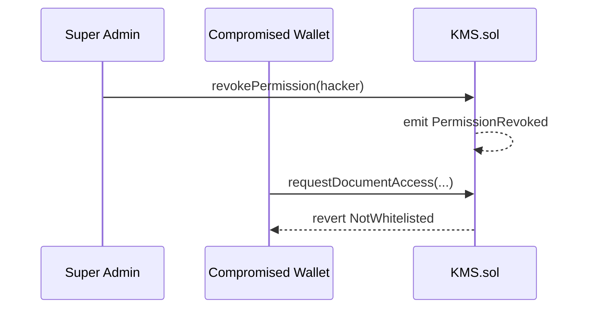

# MultiSig-KMS 아키텍처 (1페이지)

## 1. 설계 원칙: 하이브리드 분리

| 구분 | 위치 | 담당 | 저장·처리 내용 |
|------|------|------|----------------|
| **데이터** | 오프체인 (On-Premise) | 기업 보안 서버 | `Encrypted_Log.dat` 등 **암호화 원본** (공개망·IPFS 미업로드) |
| **권한** | 온체인 (Arbitrum L2) | `KMS.sol` | 복호화 **허가** (화이트리스트, 2-of-3 승인, revoke, 감사 이벤트) |

블록체인은 파일·마스터 키를 보관하지 않는다.  
`documentId`(bytes32)는 오프체인 자산을 가리키는 **식별자(해시)** 일 뿐이다.

---

## 2. 역할

| 역할 | 온체인 표현 | 권한 |
|------|-------------|------|
| 슈퍼 관리자 | `DEFAULT_ADMIN_ROLE` | `grantPermission`, `revokePermission` |
| 결재권자 (3명) | `APPROVER_ROLE` | `approveAccess` (2명 이상 시 접근 확정) |
| 요청자 (임직원) | 화이트리스트 주소 | `requestDocumentAccess` |

---

## 3. 정상 흐름 (온체인 허가 + 오프체인 복호화)

```mermaid
sequenceDiagram
    participant Admin as Super Admin
    participant User as Whitelisted User
    participant A1 as Approver 1
    participant A2 as Approver 2
    participant Chain as KMS.sol (Arbitrum)
    participant Off as On-Premise KMS

    Admin->>Chain: grantPermission(user)
    User->>Chain: requestDocumentAccess(documentId)
    Chain-->>Chain: emit AccessRequested
    A1->>Chain: approveAccess(requestId)
    A2->>Chain: approveAccess(requestId)
    Chain-->>Chain: emit DocumentAccessed
    Off->>Chain: (read) DocumentAccessed verified
    Off->>Off: decrypt Encrypted_Log.dat for user
```

**해석**

1. **온체인:** `DocumentAccessed` = “이 `documentId`에 대한 복호화 권한이 2-of-3으로 승인됨.”
2. **오프체인:** KMS 서버가 트랜잭션·이벤트를 검증한 뒤에만 실제 키/복호화 수행 (구현 예정).

기획서의 “키 조각 조합·전달”은 **오프체인 KMS** 에서 수행하고, 스마트 컨트랙트는 **허가서 발급** 에 집중한다.

---

## 4. 비상 흐름 (Revoke)



**한계 (명시):** revoke 이전에 이미 생성된 **진행 중(pending) 요청**은, 승인 2건이 모이면 완료될 수 있다.  
완전 차단이 필요하면 `cancelRequest` 등 추가 설계 검토(Phase C).

---

## 5. 트랜잭션·비용 (운영 관점)

접근 1건당 온체인 호출(대략):

| 단계 | 함수 | 비고 |
|------|------|------|
| 사전 | `grantPermission` | 신규 요청자 1회 |
| 요청 | `requestDocumentAccess` | 1 tx |
| 승인 | `approveAccess` × 2 | 2-of-3 |

Arbitrum L2는 메인넷 대비 가스·확정 시간이 유리하다.  
실측 값은 Sepolia 배포 후 README에 기록 예정(Phase B).

---

## 6. 감사 (Immutable Audit Trail)

| 이벤트 | 의미 |
|--------|------|
| `PermissionGranted` / `PermissionRevoked` | 화이트리스트 변경 |
| `AccessRequested` | 복호화 접근 요청 |
| `AccessApproved` | 결재 1표 |
| `DocumentAccessed` | 2-of-3 충족, 온체인 접근 확정 |

시각(`when`)은 이벤트가 포함된 **블록 타임스탬프**로 조회한다.

---

## 7. 보안 목표 매핑

| 위협 | 대응 |
|------|------|
| 중앙 DB 마스터 키 단일 탈취 | 승인 2-of-3 분산 |
| 비인가 지갑 요청 | 화이트리스트 + revert |
| 탈취 지갑 즉시 무력화 | `revokePermission` |
| 내부자 로그 조작 | 온체인 이벤트 불변 |

| 잔여 리스크 | 설명 |
|-------------|------|
| Admin 키 탈취 | grant/revoke 남용 가능 → 운영·HSM·멀티 admin은 확장 과제 |
| 승인자 2명+요청자 동시 탈취 | 멀티시그 한계 |
| pending + revoke | 위 4절 한계 |
